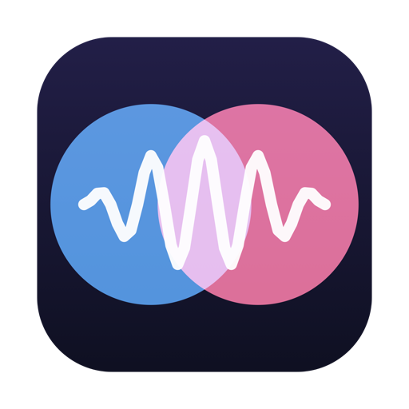
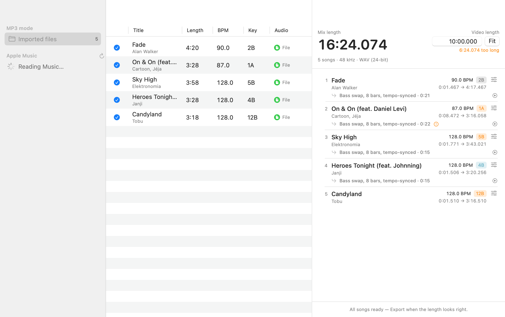
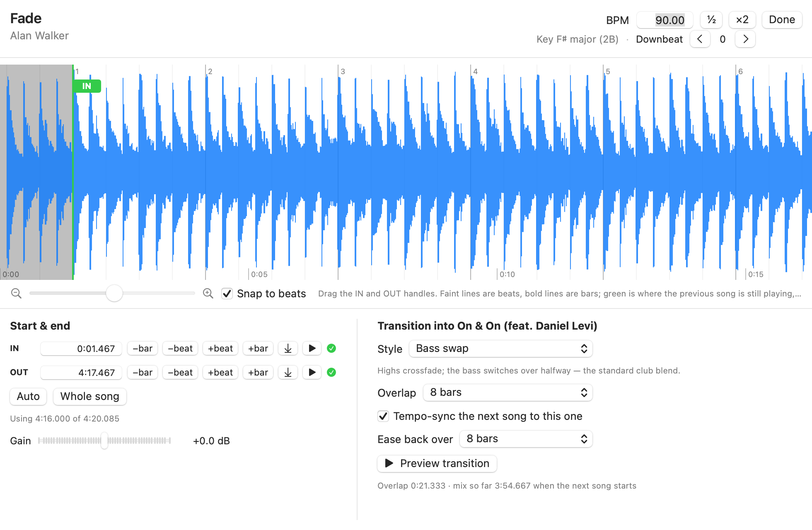

<p align="center"></p>

# Blend

A personal AutoMix for the Mac. Pick songs from your Apple Music playlists (or
drop in MP3s), put them in order, set exactly where each one starts and ends,
and Blend renders one continuous DJ-style mix — beat-matched, tempo-synced,
bass-swapped — as a WAV or MP3 for the background of a video.

The mix length updates live as you edit, to the millisecond, so you can match it
to the video *before* you render. Everything (beats, tempo, key, loudness,
stretching, mixing) runs on this Mac; nothing leaves it and no API is involved.



## Running it

`Blend.app` in this folder is ready to run (`./build.sh` rebuilds it from the
Swift sources; nothing else is needed). macOS 14.4 or later.

On first launch macOS asks two things. Both are required, both are one-time:

1. **"Blend wants to control Music"** — that's how Blend reads your playlists
   and plays songs while recording them. Click **Allow**. If you miss the prompt
   it times out as a denial; fix it in System Settings → Privacy & Security →
   **Automation** → Blend → Music, then ⌘R in Blend.
2. **System Audio Recording** — appears the first time Blend captures an Apple
   Music song. Click **Allow**. (System Settings → Privacy & Security →
   Screen & System Audio Recording → Blend, if you need to change it later.)

## How you use it

1. **Pick songs.** Choose a playlist in the sidebar, click **+** on songs (or
   double-click). MP3 mode: drop audio files anywhere in the window, or
   File → Add Audio Files; they show up under *Imported files*.
2. **Let it prepare.** Apple Music songs are DRM files no app can open, so Blend
   records the Music app playing each one — silently, through a Core Audio
   process tap, at real speed. A 4-minute song takes 4 minutes, once; the
   recording is cached, so the second mix using that song is instant. MP3s need
   no capture. Then every song is analyzed (a second or two each): tempo, beat
   grid, downbeats, key, loudness, and where the quiet intro/outro ends.
   You'll see the progress in the bottom of the mix panel. Leave it running.
3. **Set the video length** in the top-right field (`m:ss.mmm`) and watch the
   readout: *too long*, *short*, or *exact match*. **Fit** moves the last song's
   end so the mix is exactly that long.
4. **Shape it.** Drag rows to reorder. Double-click a song (or the sliders
   icon) to open it:
   - drag the **IN** and **OUT** handles on the waveform, or type times, or
     nudge by a beat or a bar. Snap keeps them on beats; the snap-to-bar button
     puts them on a downbeat so transitions line up bar-for-bar.
   - **transition** into the next song: Auto (shows what it chose and why),
     Blend, Echo out, Filter drop, or Cut; overlap/sweep length, tempo-sync and
     ease-back for blends, tail length for echoes, a riser for drops.
     **Preview transition** renders and plays just that moment.
   - IN and OUT are **auto-placed** from the song's structure until you move
     them; **Auto** puts them back. The *phrase* buttons snap to 8-bar phrase
     boundaries.
   - **BPM / ½ / ×2**, **Downbeat ‹ ›** and the **Grid** nudges are there for the
     song the analyzer gets wrong. The grid lines should sit on the kicks; if
     they sit between them, hit *−½ beat*.
   - **Gain** trims a song that's still too loud or quiet after loudness
     matching.
5. **Export** (⌘E) as WAV 24-bit (the default, and exact), WAV 16-bit, AAC, or
   MP3 320 kbps. Settings (gear icon) also hold the sample rate — 48 kHz for
   video — the end fade, loudness matching, and key lock.

Mix projects autosave; File → Save Mix As… keeps a named `.blendmix` to reopen.



## Matching the video length

The length readout *is* the render: both come from the same sample-exact layout
([Timeline.swift](Sources/Engine/Timeline.swift)), so a mix that reads 10:00.000
exports as a 10:00.000 WAV. MP3 is the one exception: the encoder pads about
50 ms of silence at the start (every MP3 does), so an MP3 comes out ~0.05 s
longer than the readout. Export WAV when the length has to be exact.

## What it actually does

- **Beat grid.** Spectral-flux onset detection → tempo by autocorrelation →
  the exact tempo by a comb filter over a 1 ms energy envelope (quantized songs
  land on their integer BPM) → beat phase from where the low band jumps (kicks
  and bass notes start *on* the beat; the off-beat, where sidechained synths
  swell back, is the classic trap for onset detectors) → downbeat from bass
  energy and where the spectrum changes. Classical DSP, no neural net; it
  locks within a few ms on produced music, and the editor shows you the grid
  so you can nudge the rare miss.
- **Key** by chroma correlation (Krumhansl-Kessler), shown as a Camelot code;
  the badge colour tells you if it clashes with the previous song.
- **Structure.** Per-beat timbre, harmony and energy give a novelty curve;
  its peaks mark section changes and decide the downbeat (drops and chord
  changes land on the "1"), the 8-bar phrase grid, the intro, the drops and
  the outro. The editor paints it along the top of the waveform.
- **Transitions** happen on phrase boundaries: mix out at the end of the
  last drop, mix in so the next song's drop lands as the old one leaves.
  **Auto** picks the move per pair — a **blend** (next song opens up filtered
  under this song's outro, bass hands over halfway, highs roll off) when both
  songs have room and the keys agree; an **echo out** (last beat rings away
  in time, next song starts clean on the 1) when the tempos are too far apart
  or there's no intro/outro; a **filter drop** (high-pass sweep, then cut on
  the phrase, optional riser) when the keys clash. Or choose yourself,
  including a hard **cut**. Blends tempo-sync the incoming song (WSOLA, key
  lock) within ±8% and ease it back to its own tempo afterwards.
- **Loudness** is matched per song (−14 dBFS RMS over the part you use) and
  the export runs through a lookahead brickwall limiter at −1 dBFS.

More detail in [docs/HOW-IT-WORKS.md](docs/HOW-IT-WORKS.md).

## When something's off

- **"Reading Music…" never finishes / red error in the sidebar** — the
  Automation permission. See *Running it*. The *Privacy settings* button in the
  sidebar opens the right pane.
- **A capture says it recorded only silence** — either System Audio Recording
  isn't granted, or macOS's permission state got wedged (it can, if a prompt
  was dismissed or Blend was quit mid-prompt). Reset it and try again:
  `tccutil reset AudioCapture com.barongartner.Blend`
- **Capture never starts playing** — Music itself can't play the song
  (subscription lapsed, song unavailable). Play it in Music once to check.
- **A transition sounds off-beat** — open that song; if the grid lines sit
  between the kicks use *−½ beat*; if the downbeat is on the wrong beat use
  *Downbeat ‹ ›*; if the song has no steady tempo (live recordings, tempo
  changes) use a short overlap or a cut.
- **Music's own Crossfade / AutoMix** doesn't interfere: Blend plays each song
  alone in a temporary "Blend Capture" playlist with repeat off, so there is
  nothing for Music to blend into.
- The log: `~/Library/Application Support/Blend/blend.log`. Captures live in
  `~/Library/Application Support/Blend/Captures/` (delete one to re-record it;
  there's also *Capture Again* in a song's right-click menu).

## Development

```
./build.sh              # compile + sign → Blend.app
./build.sh release      # also dist/Blend-<version>.zip and .dmg
./Tests/run.sh          # DSP self-test on synthesized songs (tempo, phase, alignment, export)
./Tests/run.sh a.m4a …  # analyze real files, print BPM/key/downbeat
./Tests/run.sh --mix a.m4a b.m4a …   # build, render and check a mix of real files
```

Debug launches: `open Blend.app --args --capture <persistentID>` records one
Music track headlessly; `--snapshot <dir>` renders the windows to PNGs;
`--export <file.mp3>` exports the saved mix without clicking. All log to
`blend.log`.

Signing: both permissions are keyed to the signing identity, so `build.sh`
signs with an Apple Development certificate rather than ad-hoc (which changes
every build and would re-prompt every time). This Mac has two certificates
with the same name and the kernel kills binaries signed with one of them;
`build.sh` probes each with a tiny binary and uses the one that runs.

## What it won't do

- Apple Music songs can only be captured in real time, and only on a Mac
  that can play them. There is no faster path; the audio is DRM-protected.
- It's a Mac app; nothing here runs on iPhone.
